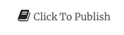
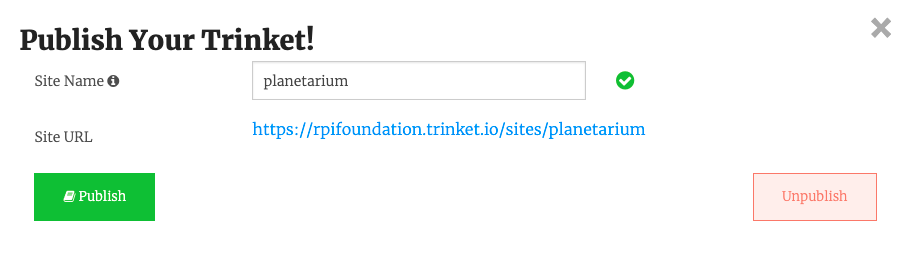
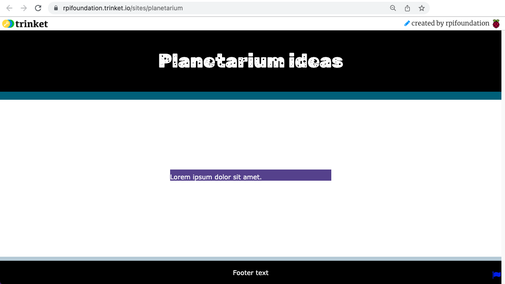

Click on the 'Click To Publish' button:

You can update the 'Site name' to customise your link then click on 'Publish'.

The URL takes you to the published version of your webpage. This is how your audience will see your webpage when you share the link with them.

